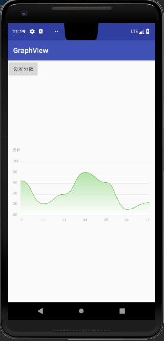
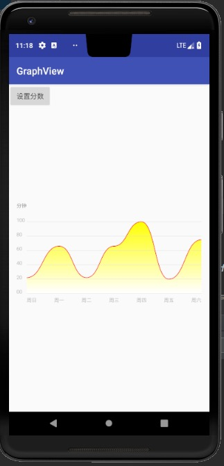
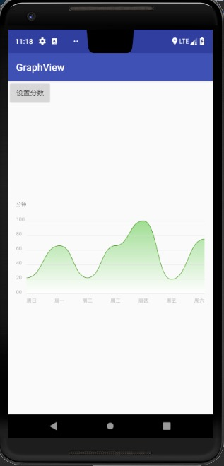
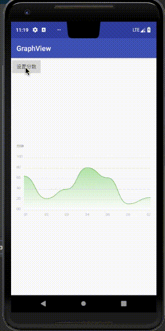

# GraphView
项目里面做的一个曲线图的View，稍微弄了一下，有什么问题可以提下issues方便改进。
#### 这是一个kotlin的项目，没有写java版本，有需要java版本的可以自己转化一下。。。
## 效果图

## 动图来一份  如果看不到的话麻烦下载项目看算了 ^_^

## 使用方法
#### Step 1. Add the JitPack repository to your build file
Add it in your root build.gradle at the end of repositories:

    allprojects {
        repositories {
                 ...
                maven { url 'https://jitpack.io' }
        }
    }

#### Step 2. Add the dependency
    dependencies {
            implementation 'com.github.ywp0919:GraphView:v1.0.1'
    }

## 部分值 设置如下，具体还是看项目代码吧。
    gvView.mEndGradientColor = Color.YELLOW
    gvView.mScoreLineColor = Color.RED

